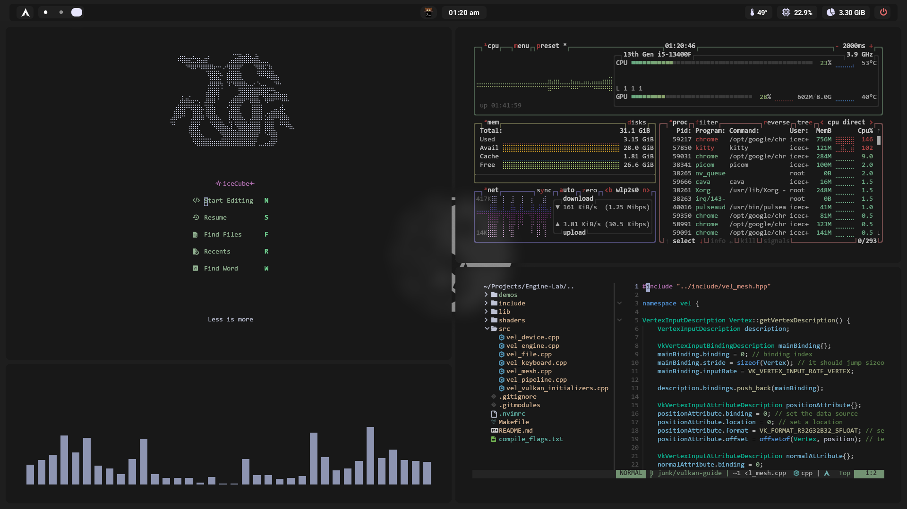
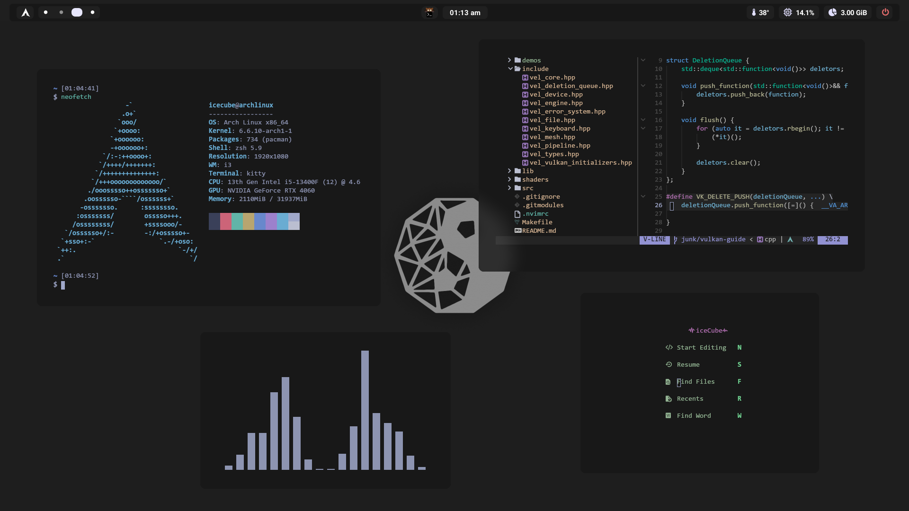
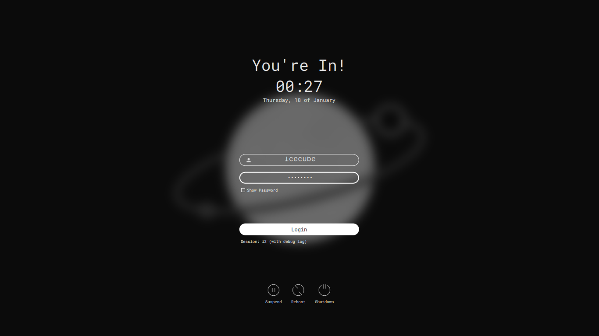

## dotfiles







- Window System: [Xorg](https://www.x.org/)
- Window Manager: [i3](https://github.com/i3/i3)
- Display Manager: [sddm](https://github.com/sddm/sddm)
- Shell: [zsh](https://www.zsh.org/)
- Terminal Emulator: [kitty](https://sw.kovidgoyal.net/kitty/)
- Top bar: [eww](https://github.com/elkowar/eww)
- App launcher: [rofi](https://github.com/davatorium/rofi)

Check [packages.lst](packages.lst) to see all the dependencies, and the
[dots branch](https://github.com/nablaFox/dotfiles/tree/dots) for the actual
configuration files.

### Installation

> [!CAUTION]
> The following script is intended to be run after a minimal Arch installation. <br>

```sh
git clone https://github.com/nablaFox/dotfiles
dotfiles/install.sh
reboot
```

### Keybindings

|Keys|Action|
|:----|:----|
|<kbd>Win</kbd> + <kbd>Q</kbd>|Close active/focused window|
|<kbd>Win</kbd> + <kbd>J</kbd>|Focus down|
|<kbd>Win</kbd> + <kbd>K</kbd>|Focus up|
|<kbd>Win</kbd> + <kbd>H</kbd>|Focus left|
|<kbd>Win</kbd> + <kbd>L</kbd>|Focus right|
|<kbd>Alt</kbd> + <kbd>V</kbd>|Split horizontally|
|<kbd>Alt</kbd> + <kbd>H</kbd>|Split vertically|
|<kbd>Alt</kbd> + <kbd>Return</kbd>|Toggle fullscreen|
|<kbd>Win</kbd> + <kbd>Y</kbd>|Save current layout|
|<kbd>Win</kbd> + <kbd>T</kbd>|Restore saved layout|
|<kbd>Win</kbd> + <kbd>n</kbd>|Switch to workspace n|
|<kbd>Win</kbd> + <kbd>Shift</kbd> + <kbd>n</kbd>|Move focused window to workspace n|
|<kbd>Win</kbd> + <kbd>Space</kbd>|Toggle between tiling/floating|
|<kbd>Win</kbd> + <kbd>I</kbd>|Lock the screen|
|<kbd>Win</kbd> + <kbd>O</kbd>|Open top bar|
|<kbd>Win</kbd> + <kbd>P</kbd>|Close top bar|
|<kbd>Win</kbd> + <kbd>Return</kbd>|Open kitty|
|<kbd>Win</kbd> + <kbd>V</kbd>|Open Neovim|
|<kbd>Win</kbd> + <kbd>E</kbd>|Open Ranger|
|<kbd>Win</kbd> + <kbd>C</kbd>|Open Chromium|
|<kbd>Win</kbd> + <kbd>D</kbd>|Open app launcher|
|<kbd>Win</kbd> + <kbd>X</kbd>|Open screenshot menu|
|<kbd>Win</kbd> + <kbd>Z</kbd>|Open power menu|
|<kbd>Win</kbd> + <kbd>Escape</kbd>|Exit from i3 session|

To edit/add/see other keybindings, check `~/.config/i3` or run `cfi`.

### Version control

The installation script will create a bare repository inside `~/.dotfiles`.
This is useful if you want to manage your dotfiles with git.

For example:

1. Link your remote repository:

```sh
dots remote add origin git@github.com:username/dotfiles-repo.git
```

2. Make some changes:

```sh
rice ~/.zshrc
```

3. Stage and commit changes:

```sh
dots add ~/.zshrc
dots commit -m "updated .zshrc"
dots push origin main
```

On a new system you can restore your dotfiles by running:

```sh
git clone --bare git@github.com:username/dotfiles-repo.git your-dotfiles-path
alias dots='git --git-dir=$HOME/your-dotfiles-path/ --work-tree=$HOME'
dots config --local status.showUntrackedFiles no
dots checkout
```

### Work in progress

- top bar update
- rofi replaced by eww widget
- custom sddm theme
- handling optional packages

### Credits

- [Keyitdev](https://github.com/Keyitdev/dotfiles)
- [rusty-electron](https://github.com/rusty-electron/dotfiles)
- [gh0stzk](https://github.com/gh0stzk/dotfiles)
